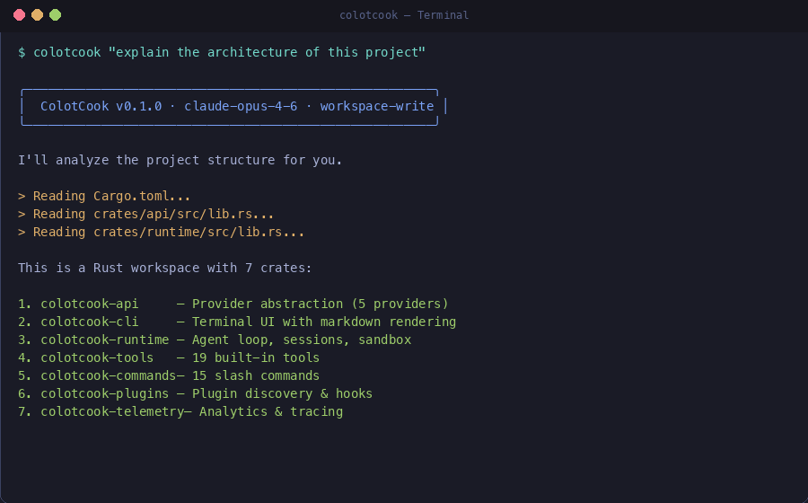
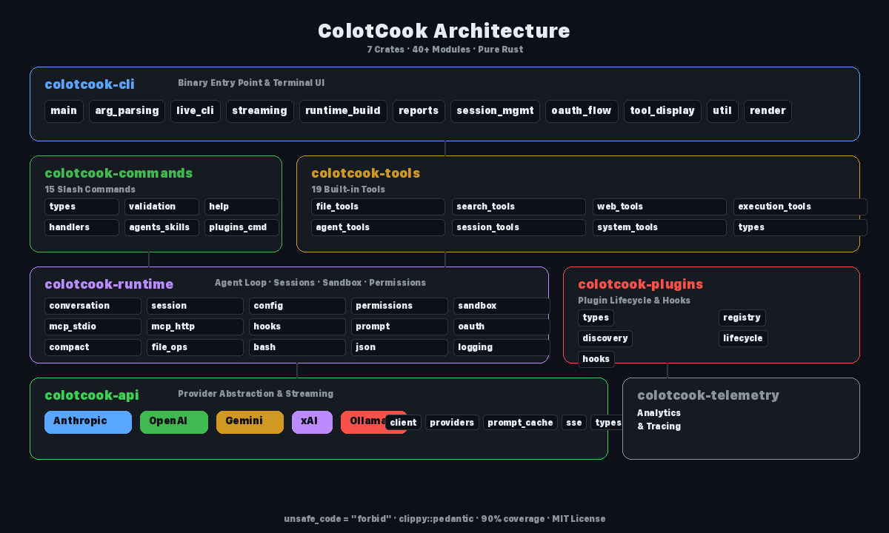

<div align="center">

# ColotCook

**A production-ready AI coding agent written in pure Rust.**

Multi-provider support (Claude, GPT, Gemini, Grok, Ollama) · 19 built-in tools · Plugin system · MCP protocol · Sandbox isolation

[](https://github.com/tranhoangtu-it/ColotCook/actions/workflows/ci.yml)
[](LICENSE)
[](https://www.rust-lang.org/)
[](#code-quality)
[](#code-quality)

[Getting Started](#quick-start) · [Demo](#demo) · [Features](#features) · [Architecture](#architecture) · [Contributing](CONTRIBUTING.md)

</div>

---

## Why ColotCook?

| | ColotCook | Claude Code | Cursor | Aider |
|---|---|---|---|---|
| **Language** | Pure Rust (single binary) | Node.js | Electron | Python |
| **Providers** | 5 (Claude, GPT, Gemini, Grok, Ollama) | Claude only | Multiple | Multiple |
| **Local models** | Ollama built-in | No | No | Yes |
| **MCP protocol** | Full support | Yes | No | No |
| **Plugin system** | Hooks + lifecycle | Yes | No | No |
| **Sandbox** | Linux namespaces | Yes | No | No |
| **Open source** | MIT | Proprietary | Proprietary | Apache-2.0 |
| **Install size** | ~15MB binary | ~200MB | ~500MB | ~50MB |

## Demo

<div align="center">



</div>

**Explain code, fix bugs, review PRs — all from your terminal:**

```bash
# Ask about your codebase
colotcook "explain the architecture of this project"

# Fix a bug with a local model
colotcook --model ollama:llama3 "fix the bug in src/parser.rs"

# Review a PR with Gemini
colotcook --model gemini-2.5-pro "review this PR"

# Check session status
colotcook --resume latest /status
```

## Features

- **Pure Rust** — no Python runtime, no Node.js, just a single compiled binary
- **Multi-provider support** — Anthropic Claude, OpenAI/GPT, Google Gemini, xAI Grok, and Ollama (local models)
- **19 built-in tools** — file operations, shell execution, search, web fetch, MCP integration, and more
- **15 slash commands** — `/export`, `/config`, `/status`, `/clear`, `/compact`, and others
- **Session persistence** — resume conversations with `--resume` or `--resume latest`
- **Plugin & hook system** — extend behavior with PreToolUse/PostToolUse hooks
- **MCP protocol** — connect to external tool servers via stdio, SSE, HTTP, and more
- **Permission modes** — `read-only`, `workspace-write`, `danger-full-access`, `prompt`, `allow`
- **Streaming responses** — real-time SSE streaming from all providers
- **Prompt caching** — reduce API costs with intelligent prompt cache management
- **Sandbox isolation** — Linux namespace-based sandboxing for safe code execution
- **OAuth authentication** — secure token-based auth with auto-refresh

## Architecture

<div align="center">



</div>

ColotCook is organized as a Rust workspace with 7 crates and 40+ modules:

```
ColotCook/
├── Cargo.toml              # Workspace root
├── Cargo.lock              # Dependency lock file
├── deny.toml               # License & vulnerability auditing
└── crates/
    ├── api/                # Provider abstraction & streaming
    │   └── providers/      # Anthropic, OpenAI, Gemini, xAI, Ollama
    ├── cli/                # Binary entry point & terminal UI
    │   ├── arg_parsing     # CLI argument handling
    │   ├── streaming       # SSE response streaming
    │   ├── live_cli        # Interactive REPL
    │   ├── reports         # Status/cost/config formatting
    │   └── ...8 more modules
    ├── commands/           # 15 slash commands
    │   ├── validation      # Input parsing & validation
    │   ├── handlers        # Command dispatch
    │   └── agents_skills   # Agent/skill discovery
    ├── plugins/            # Plugin lifecycle & hooks
    │   ├── registry        # Plugin management
    │   ├── discovery       # Filesystem scanning
    │   └── lifecycle       # Init/shutdown/hooks
    ├── runtime/            # Agent loop, sessions, sandbox
    │   ├── conversation    # Core agent loop
    │   ├── mcp_stdio       # MCP stdio transport
    │   ├── mcp_http        # MCP HTTP/SSE transport
    │   └── ...12 more modules
    ├── telemetry/          # Analytics & tracing
    └── tools/              # 19 tool specifications
        ├── agent_tools     # Sub-agent orchestration
        ├── web_tools       # WebFetch, WebSearch
        ├── file_tools      # Read, Write, Edit
        └── ...5 more modules
```

## Supported Providers

| Provider | Models | Auth |
|----------|--------|------|
| **Anthropic** | claude-opus-4-6, claude-sonnet-4-6, claude-haiku-4-5 | `ANTHROPIC_API_KEY` |
| **OpenAI** | gpt-4o, gpt-4-turbo, o1, o3 | `OPENAI_API_KEY` |
| **Google Gemini** | gemini-2.5-pro, gemini-2.5-flash | `GEMINI_API_KEY` or `GOOGLE_API_KEY` |
| **xAI** | grok-3 | `XAI_API_KEY` |
| **Ollama** | llama3, codellama, deepseek-coder, qwen2.5-coder, ... | No key needed (local) |

## Quick Start

### Prerequisites

- [Rust](https://www.rust-lang.org/tools/install) (edition 2021+)
- An API key for at least one supported provider (or Ollama for local models)

### Build from source

```bash
git clone https://github.com/tranhoangtu-it/ColotCook.git
cd ColotCook
cargo build --release
```

The binary will be at `target/release/colotcook`.

### Usage

```bash
# Start a new conversation (default: Anthropic Claude)
colotcook "explain this codebase"

# Use a specific model
colotcook --model gemini-2.5-pro "review this PR"

# Use Ollama (local)
colotcook --model ollama:llama3 "write tests for this function"

# Resume a previous session
colotcook --resume latest "continue where we left off"

# Permission modes
colotcook --permission-mode workspace-write "refactor this module"

# JSON output for scripting
colotcook --output-format json "list all TODO comments"

# Slash commands
colotcook --resume latest /status
colotcook --resume latest /export notes.txt
colotcook --resume latest /config model
```

### Environment Variables

```bash
# Required for Anthropic (default provider)
export ANTHROPIC_API_KEY="sk-ant-..."

# Optional: other providers
export OPENAI_API_KEY="sk-..."
export GEMINI_API_KEY="..."
export XAI_API_KEY="..."

# Optional: custom base URLs
export ANTHROPIC_BASE_URL="https://..."
export OPENAI_BASE_URL="https://..."
export GEMINI_BASE_URL="https://..."
export OLLAMA_BASE_URL="http://localhost:11434/v1"
```

## Configuration

ColotCook loads settings from multiple sources (highest priority first):

1. CLI flags (`--model`, `--permission-mode`)
2. Project-local config: `.colotcook/settings.local.json`
3. Project config: `.colotcook/settings.json`
4. User config: `~/.colotcook/settings.json`

Use `/config` to inspect the merged configuration.

## Built-in Tools

| Category | Tools |
|----------|-------|
| **File operations** | Read, Write, Edit, MultiEdit, NotebookEdit |
| **Search** | Glob, Grep, Search |
| **Execution** | Bash, BashBackground |
| **Web** | WebFetch, WebSearch |
| **Session** | TodoRead, TodoWrite |
| **Integration** | McpTool, UseMcpServer |
| **Agent** | Agent, Task |
| **System** | AskFollowupQuestion |

## Slash Commands

| Command | Description |
|---------|-------------|
| `/help` | Show available commands |
| `/status` | Session info, model, usage |
| `/compact` | Compress conversation history |
| `/clear` | Reset current session |
| `/config` | Inspect merged configuration |
| `/model` | Switch AI model |
| `/permissions` | Change permission mode |
| `/cost` | Show token usage and cost |
| `/export` | Export conversation to file |
| `/resume` | Load a previous session |
| `/session` | List and manage sessions |
| `/diff` | Show git workspace changes |
| `/version` | Print version info |
| `/plugins` | Manage plugins |
| `/agents` | List available agents |

## Bundled Plugins

- **colotcook-guard** — Pre-execution safety checks via `pre-guard.sh` hook
- **example-bundled** — Example plugin demonstrating pre/post hook lifecycle
- **sample-hooks** — Sample hook implementations for reference

## Development

```bash
# Run all tests (~2000 tests)
cargo test

# Run tests for a specific crate
cargo test -p colotcook-api
cargo test -p colotcook-runtime

# Lint (zero warnings enforced)
cargo clippy --workspace -- -D warnings

# Format
cargo fmt --all

# Security audit
cargo deny check

# Coverage report
./scripts/coverage.sh
```

## Code Quality

| Metric | Value |
|--------|-------|
| Clippy warnings | 0 (pedantic + all lints) |
| Test count | ~2000 |
| Line coverage | 89.5% |
| Region coverage | 90.1% |
| Production `.expect()` | 0 |
| `unsafe` code | Forbidden workspace-wide |
| CI pipeline | Format, Clippy, Test, Deny |

## Roadmap

- [ ] Interactive REPL mode with tab completion
- [ ] Built-in RAG with codebase indexing
- [ ] VS Code / Neovim extensions
- [ ] Cross-compilation for Linux/Windows/macOS releases
- [ ] Plugin marketplace
- [ ] Multi-agent collaboration workflows
- [ ] Voice input support
- [ ] Custom tool SDK for third-party tools

See [Discussions](https://github.com/tranhoangtu-it/ColotCook/discussions) for feature requests and ideas.

## Contributing

We welcome contributions! See [CONTRIBUTING.md](CONTRIBUTING.md) for guidelines.

## License

MIT

---

<div align="center">

**If ColotCook helps your workflow, consider giving it a star!**

[](https://github.com/tranhoangtu-it/ColotCook)

Built with Rust. Made in Vietnam.

</div>
